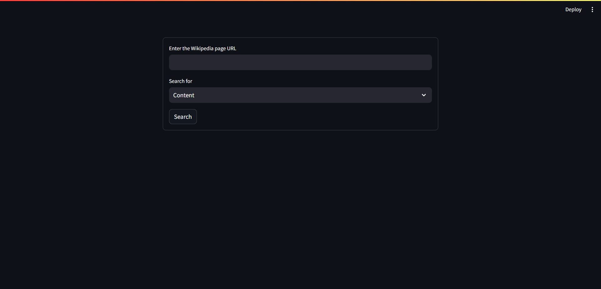

# Wikinsight Express

[Link to the website](https://github.com/Tanay-Dwivedi/Wiki-Scraper)

This app is a versatile Wikipedia search tool built using Streamlit, a Python library for creating interactive web applications. With this app, users can effortlessly explore various aspects of Wikipedia pages simply by entering the URL of the desired Wikipedia page. Once the URL is provided, users have the option to choose from a range of functionalities tailored to enhance their Wikipedia browsing experience.

Firstly, users can delve into the content of the Wikipedia page, either viewing the full content or a concise summary. This feature provides a quick and convenient way to access the information they need without having to navigate through the entire page. Additionally, users can explore images associated with the Wikipedia page, enabling them to visualize the content and gain a deeper understanding.

Moreover, the app offers analytical capabilities such as word frequency analysis and sentiment analysis. With word frequency analysis, users can identify the most frequently occurring words in the Wikipedia page, gaining insights into the key topics or themes discussed. On the other hand, sentiment analysis allows users to understand the overall sentiment expressed in the page's content, whether it's positive, negative, or neutral, along with a breakdown of sentiment-bearing words.

Overall, this app provides a user-friendly interface for exploring and analyzing Wikipedia content in a streamlined manner. Whether users are conducting research, seeking information, or simply curious about a particular topic, this app offers a comprehensive set of tools to satisfy their informational needs effectively and efficiently.

-----

## Installation

```
pip install streamlit
```
```
pip install wikipedia
```
```
pip install matplotlib
```
```
pip install pandas
```
```
pip install textblob
```
```
pip install plotly
```
Firstly import the `streamlit`, `wikipedia`, `matplotlib`, `textblob`, `pandas`, and `plotly` libraries through the terminal that will help in the program.

-----

## How to run:

Download the zip file and extract the files. Then open your terminal or command prompt, navigate to the directory where the `main.py` python file is saved, and run the following command:

```
streamlit run main.py
```

-----

## Aim of the Project:

1. **Improved Wikipedia Exploration**: Enhance user experience by offering convenient access to Wikipedia content, including text, summaries, images, and references.

2. **Data Analysis Tools**: Provide users with analytical capabilities such as word frequency analysis and sentiment analysis to extract insights and understand the content on a deeper level.

3. **Efficient Information Retrieval**: Streamline the process of finding specific information on Wikipedia pages by allowing users to input URLs and select their desired type of information, making the search process faster and more intuitive.

-----

## List of functions:

1. `show_warning(message)`: Displays a warning message using Streamlit.

2. `wiki_content(url)`: Retrieves the content of a Wikipedia page.

3. `wiki_summary(url)`: Retrieves a summary of a Wikipedia page.

4. `wiki_images(url)`: Retrieves images associated with a Wikipedia page.

5. `wiki_references(url)`: Retrieves references cited in a Wikipedia page.

6. `freq_words(text)`: Performs word frequency analysis on text data.

7. `wiki_sentimental_analysis(url)`: Performs sentiment analysis on the content of a Wikipedia page.

8. `time_taken()`: Calculates and displays the time taken for code execution.

-----

## Advantages:

1. **Comprehensive Access**: Users can explore diverse Wikipedia content, including text, summaries, images, and references, all in one place.

2. **Insightful Analysis**: The app offers analytical tools like word frequency and sentiment analysis, empowering users to gain deeper insights into the content.

3. **User-Friendly**: With an intuitive interface, users can easily input URLs and navigate through features, catering to users of all skill levels.

4. **Time-saving**: By streamlining information retrieval and providing analytical insights, the app helps users efficiently achieve their research or browsing objectives.

-----

## Disadvantages & Limitations:

1. **Dependency on Wikipedia**: The project's effectiveness relies heavily on the availability and accuracy of data from Wikipedia.

2. **Limited Analytical Depth**: While offering analytical tools, the app may have constraints in conducting advanced textual analysis compared to specialized research tools.

3. **Potential for Incomplete Information**: Users may encounter situations where certain Wikipedia pages lack sufficient content or references, limiting the app's usefulness for in-depth research.

-----

## Future Improvements:

1. **Diversify Data Sources**: Integrate additional data sources beyond Wikipedia for a broader range of information.

2. **Advanced Analytics**: Implement more sophisticated analytical techniques, such as NLP and machine learning, for deeper insights.

3. **User Customization**: Provide options for users to customize analytical parameters to better suit their needs.

4. **Interactive Visualization**: Introduce interactive visualizations to enhance data presentation and interpretation.

-----

## Technologies Learned:

1. **Streamlit**: Used for creating interactive web applications in Python.

2. **Wikipedia API (wikipedia)**: Enables access to Wikipedia content programmatically.

3. **Matplotlib**: Used for generating visualizations such as bar charts.

4. **TextBlob**: Provides tools for natural language processing tasks like sentiment analysis.

5. **Pandas**: Used for data manipulation and analysis, particularly for creating dataframes.

-----

## Output:




----